## TAREA 1: CONFLICTO SIMULADO

### Apartado Tu:
1. Primero modificamos el  pom.xml para eso creamos en la rama develop otra rama que se llama comentario-inicio hay que hacer la rama develop/comentario-inicio para eso hay que hacer lo siguiente:
```
git checkout -b develop/comentario-inicio
```


2. Modificamos el pom.xml y cuando los modifiquemos y lo subamos a la raiz de comentario de inicio nos pedira un pull que es lo siguiente:
   
   

   
   

## Paso 2. TU-SECRETARIO de Raul Modifica pom.xml:

1. Nos cambiamos  a la rama develop con los siguientes comandos.
   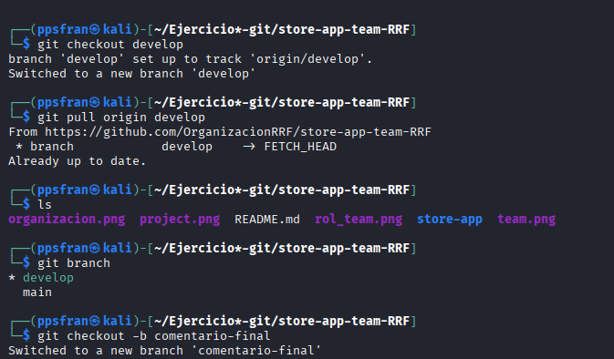
   
2. Crear una rama con nombre comentario-final con los siguientes comandos:
    
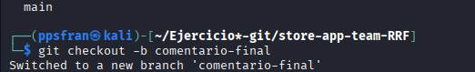


3. editamos el pom.xml:


4. Hacemos los cambios para subirlo y que el jefe acepte el pull :
   
   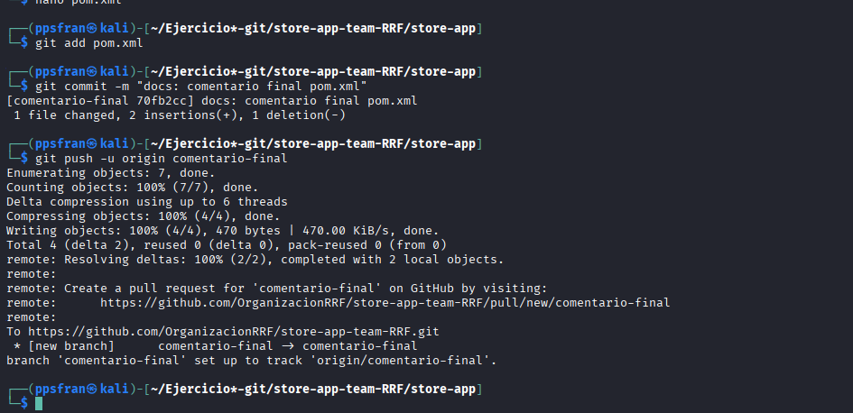
   

## TAREA 2: FEATURE DEV

1. Primero hacemos la tarea para lo que tiene que hacer el secretario:
   
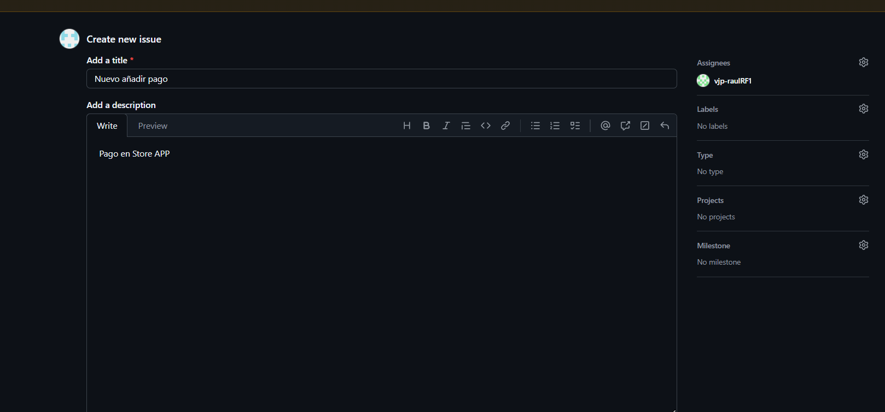

* Vemos que se ha creado:

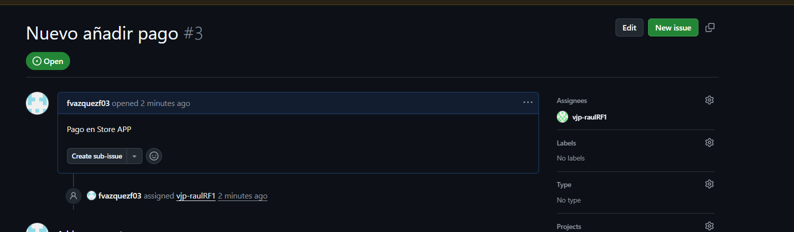

2. Vemos que se ah creado la tera en el board :
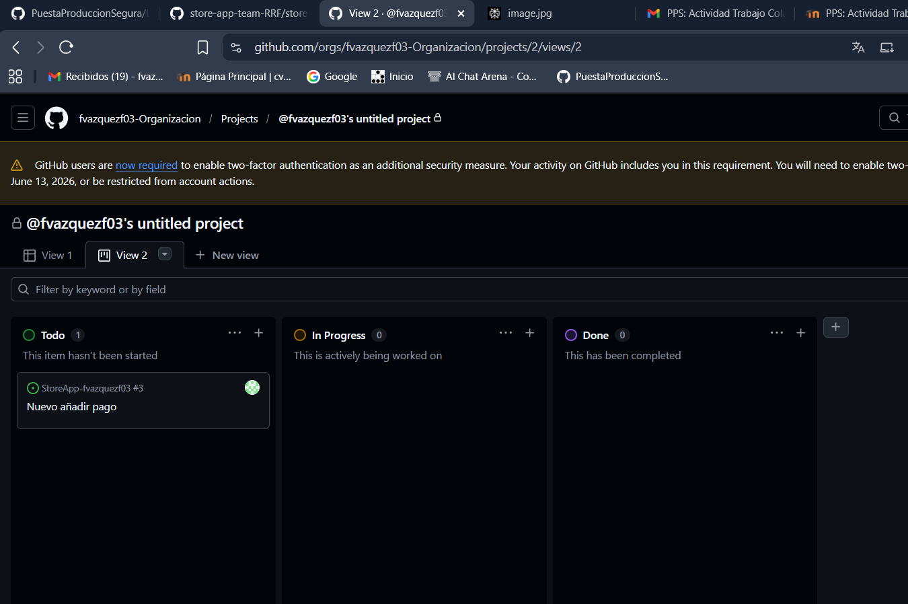

### Paso 2. TU-SECRETARIO recibe asignación y trabaja en ella:

1. Primero vemo lo que tenmos asignado de tarea y le contestamos al jefe:
   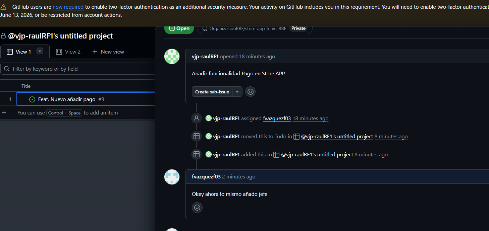 

2. Antes de crear rama add-pagos, creamos rama features a partir de main.:

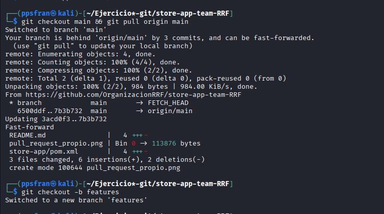

3. Crear rama add-pagos a partir de features:

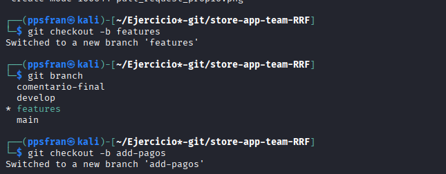

### Paso 3: TU-SECRETARIO crea el archivo BizumPaymentService.java y pull request.

1. Creamos el archivo dentro de la siguiente ruta **/src/main/java/es/storeapp/business/services/**

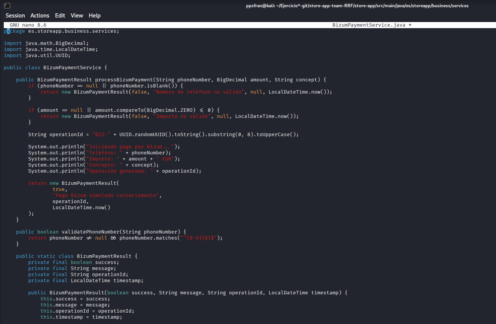

2. Solicitamos el  Pull request.

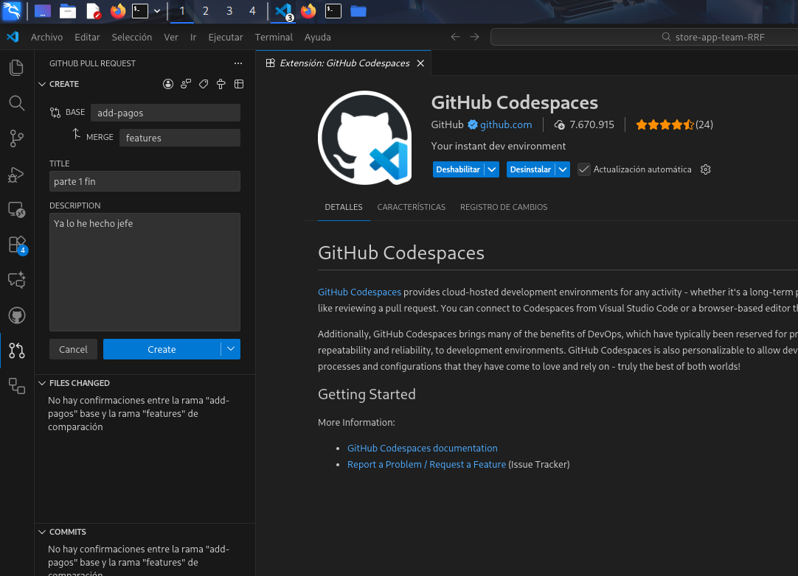

### Paso 4: TU lo aceptas e incorporas y cierras el feat.

1. Lo aceptamos y le damos a completado la tarea:


## TAREA 3: Hotfix

1. creamo la incidencia: 


### Paso 2: TU-SECRETARIO soluciona la incidencia y abre Pull request.

1. Creaos y actualizamos las ramas:

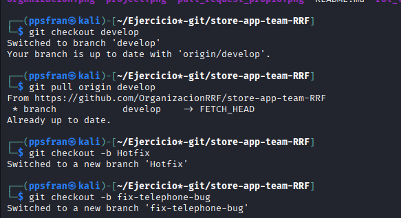

2. Arreglamos la app:

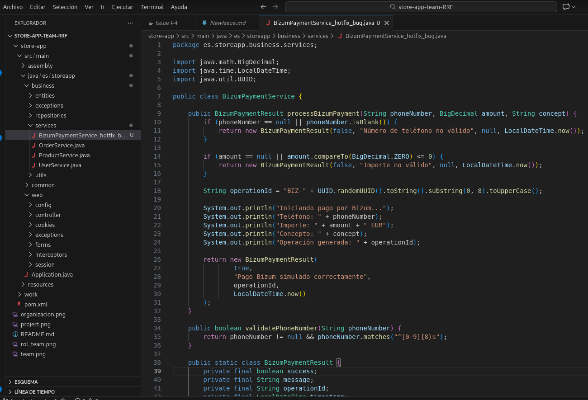

3. Hacemos el pull request y no los acepta y ya hemos solucionado el error: 

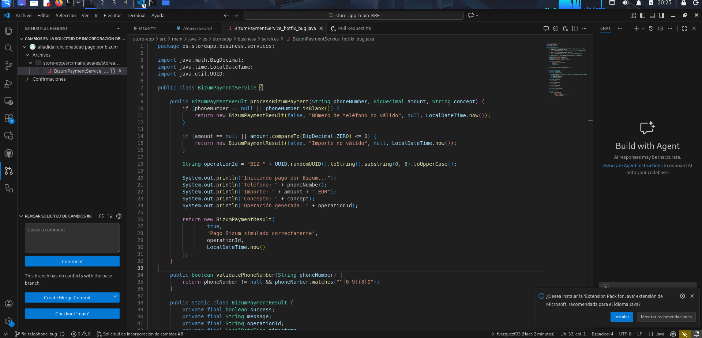

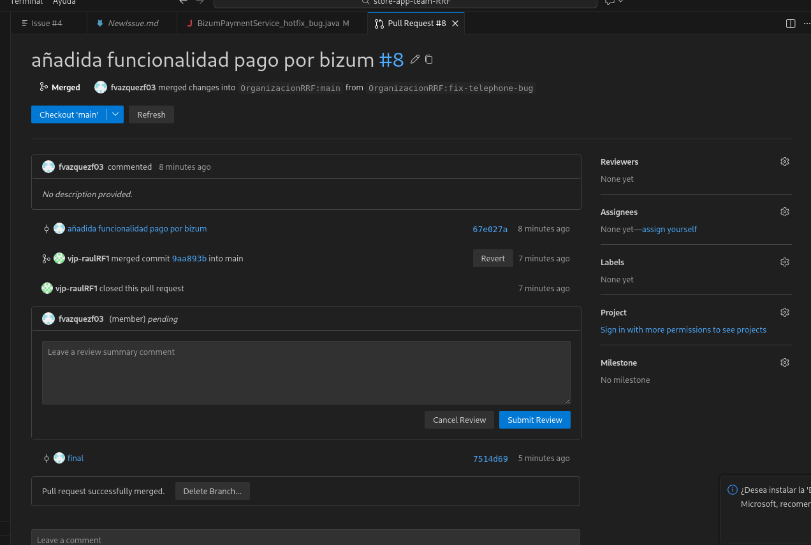


