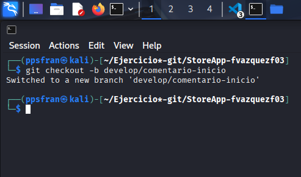
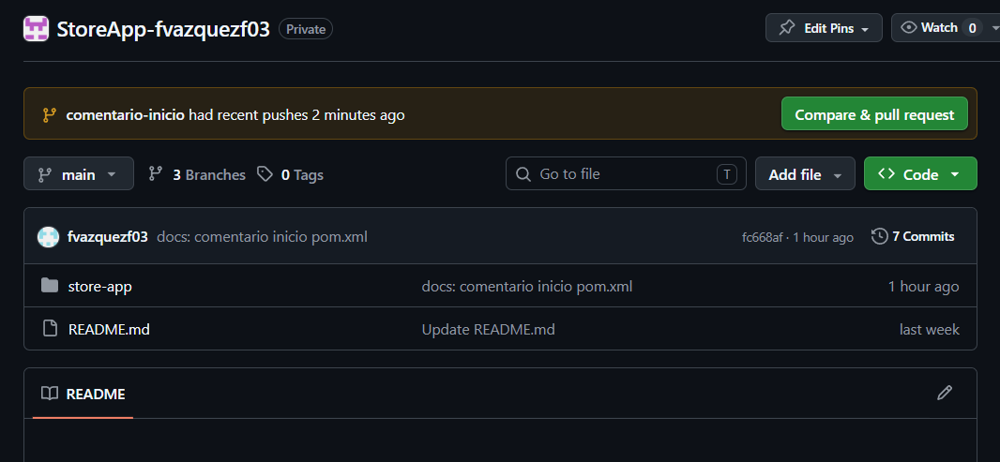
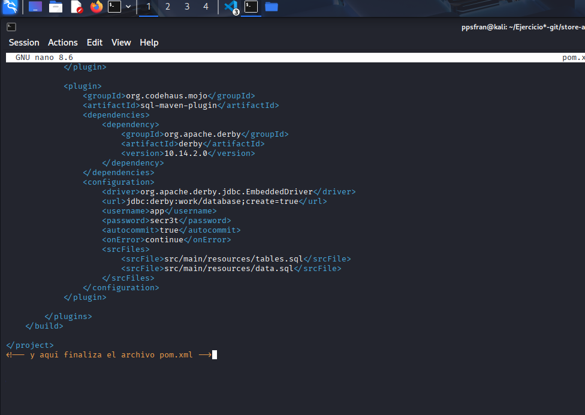

## TAREA 1: CONFLICTO SIMULADO

### Apartado Tu:
1. Primero modificamos el  pom.xml para eso creamos en la rama develop otra rama que se llama comentario-inicio hay que hacer la rama develop/comentario-inicio para eso hay que hacer lo siguiente:
```
git checkout -b develop/comentario-inicio
```


2. Modificamos el pom.xml y cuando los modifiquemos y lo subamos a la raiz de comentario de inicio nos pedira un pull que es lo siguiente:
   
   

   
   

## Paso 2. TU-SECRETARIO de Raul Modifica pom.xml:

1. Nos cambiamos  a la rama develop con los siguientes comandos.
   
   
2. Crear una rama con nombre comentario-final con los siguientes comandos:
    


3. editamos el pom.xml:



4. Hacemos los cambios para subirlo y que el jefe acepte el pull :
   
   
   

## TAREA 2: FEATURE DEV

